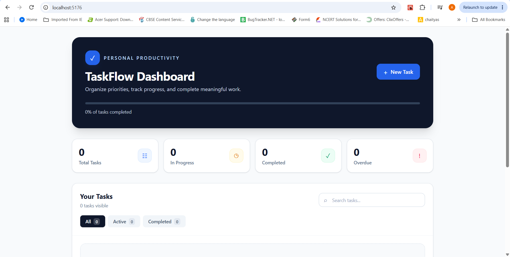
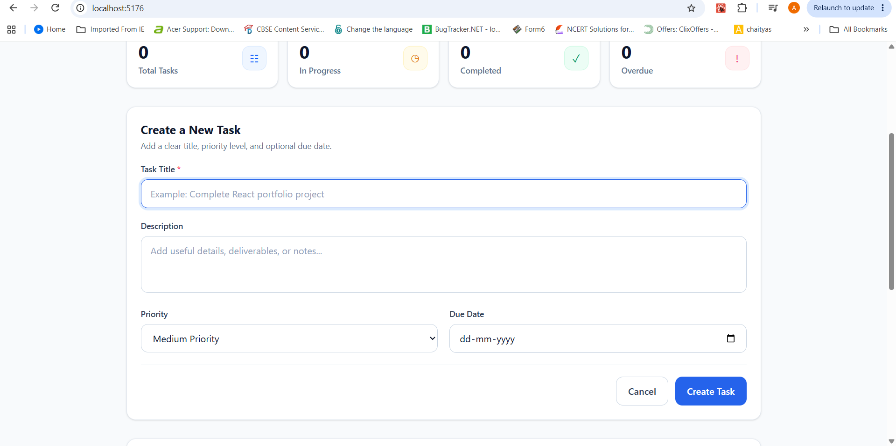
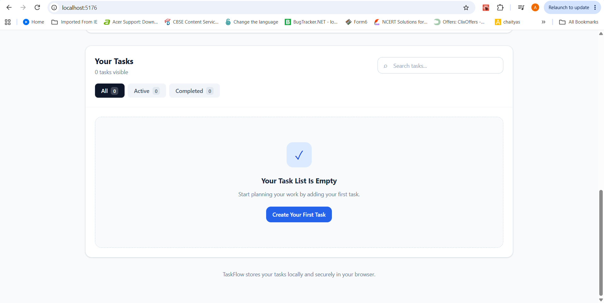

# TaskFlow — Local Storage Task Tracker


A professional, responsive task management dashboard built with React, Vite, Tailwind CSS v4, and the LocalStorage API.

TaskFlow helps users plan work, manage priorities, track task completion, and preserve tasks across browser sessions without requiring a backend or user account.

> **Live Demo:** Add your GitHub Pages link here after deployment  
> `https://aaryani-task-tracker.netlify.app/`

## Preview

### Dashboard



### Create Task



### Search and Filters



## Features

- Create, read, update, and delete tasks
- Add a title, description, priority, and due date to each task
- Mark tasks as active or completed
- Search tasks by title or description
- Filter tasks by All, Active, and Completed status
- Display Low, Medium, and High task priorities
- Detect overdue incomplete tasks
- Track Total, In Progress, Completed, and Overdue task counts
- Show a visual completion-rate progress bar
- Confirm before deleting a task or clearing completed tasks
- Persist task data using the browser LocalStorage API
- Provide a responsive UI for mobile, tablet, and desktop screens

## Tech Stack

| Technology | Purpose |
|---|---|
| React | Component-based user interface and state management |
| JavaScript | Application logic and task operations |
| Vite | Development server and production build tool |
| Tailwind CSS v4 | Responsive, utility-first styling |
| LocalStorage API | Client-side task persistence |
| GitHub Pages | Static site deployment |

## Project Structure

```text
task-tracker/
├── public/
│   └── screenshots/
│       ├── dashboard.png
│       ├── create-task.png
│       └── filters-search.png
├── src/
│   ├── components/
│   │   ├── EmptyState.jsx
│   │   ├── Header.jsx
│   │   ├── StatCard.jsx
│   │   ├── StatsDashboard.jsx
│   │   ├── TaskFilters.jsx
│   │   ├── TaskForm.jsx
│   │   ├── TaskItem.jsx
│   │   └── TaskList.jsx
│   ├── hooks/
│   │   └── useLocalStorage.js
│   ├── utils/
│   │   └── taskHelpers.js
│   ├── App.jsx
│   ├── index.css
│   └── main.jsx
├── README.md
├── package.json
└── vite.config.js
```

## Installation

### Prerequisites

Install Node.js before running this project.

### Steps

1. Clone the repository:

```bash
git clone [https://github.com/aaryani2258/taskflow-task-tracker.git](https://github.com/aaryani2258/taskflow-task-tracker.git)
```

2. Move into the project folder:

```bash
cd taskflow-task-tracker
```

3. Install dependencies:

```bash
npm install
```

4. Start the development server:

```bash
npm run dev
```

5. Open the localhost address shown in the terminal, usually:

```text
http://localhost:5173/
```

## Key Learning Outcomes

- Managing application state with React hooks
- Building reusable and maintainable React components
- Implementing complete CRUD operations
- Creating controlled forms for task creation and editing
- Persisting browser data with a custom LocalStorage hook
- Calculating filtered tasks and dashboard statistics with derived state
- Handling priorities, due dates, task completion, and overdue states
- Designing a responsive application with Tailwind CSS v4
- Using Git, GitHub, and GitHub Pages for project management and deployment

## Author

**Aaryani Bharathiraja**

- GitHub: [@aaryani2258](https://github.com/aaryani2258)